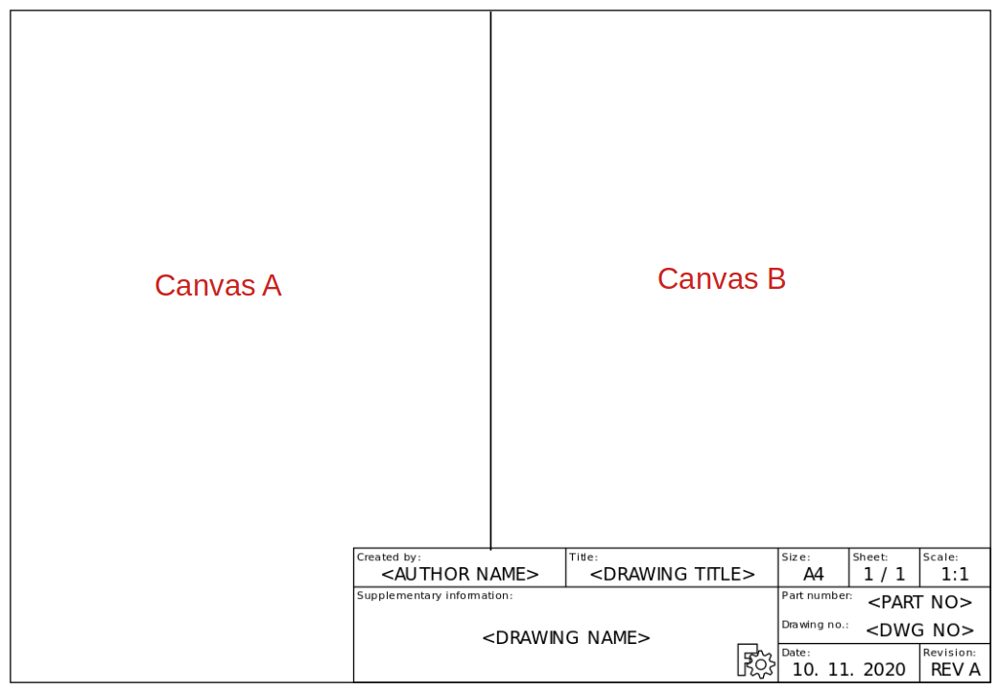

## W24Canvas

The W24Canvas descibes the part of the W24Sheet that is thought to carry the drawing. Keep in mind that some Sheets will
contain 2 or more Canvases. When you request a W24AskCanvasThumbnail, be sure to handle all the responses!

### W24AskCanvasThumbnail

The W24AskCanvasThumbnail will return a thumbnail for each canvas on the sheet

| PAYLOAD DICT |                                                      | Example                                       |
| ------------ | -----------------------------------------------------|---------------------------------------------- |
| document_id  | `UUID4` -- Unique `UUID` that identifies the document    |  "44200f9b-1bb6-48bc-9370-de8a28e8dbbb"       |
| page_id      | `UUID4` -- Unqiue `UUID` that identifies the page        |  "89f54424-343e-4fd5-8b7d-e09ea5f310fd"       |
| sheet_id     | `UUID4` -- Unqiue `UUID` that identifies the sheet       |  "5bc164d4-df0d-4482-9048-3a84de010abf"       |
| canvas_id    | `UUID4` -- Unqiue `UUID` that identifies the canvas      |  "9e6399a6-0b43-4b47-a416-0918254bba16"       |

| PAYLOAD URL |                                                       | Example                                       |
| ----------- | ------------------------------------------------------|---------------------------------------------- |
| url         | str -- Url of the payload (requires token authentication) |Example: https://techread.w24.io/download/1a0230ea-4a96-4522-ae8e-a25aed463a3e |

