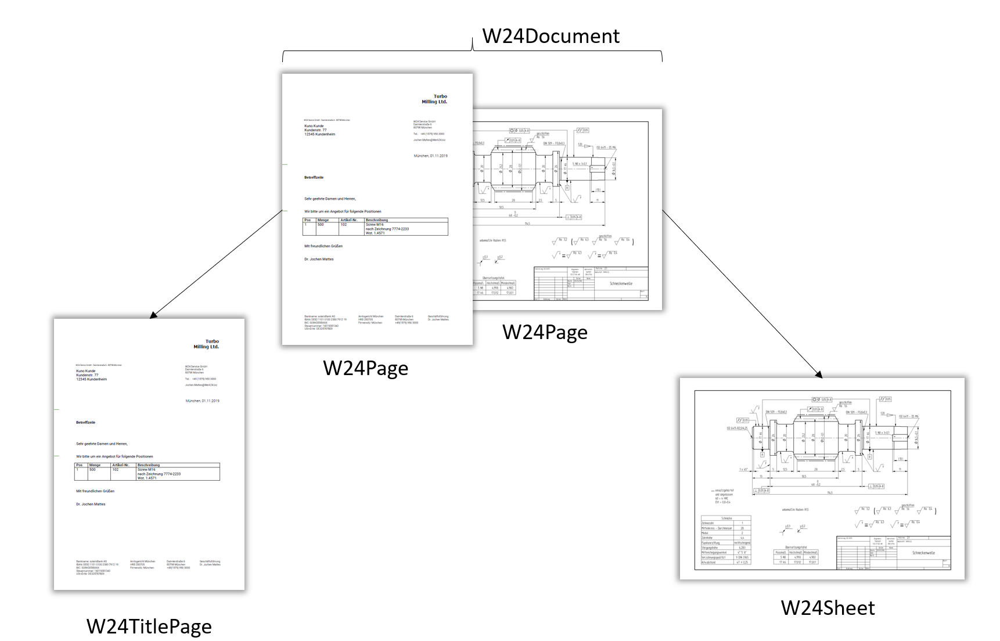

## W24Document & W24Page

As the image below illustrates, a W24Document constist of one more multiple W24Pages. You can think of it as the pages in the PDF document that you submitted. If you send us an image, the W24Document will have exactly one page: your image. Our algorithm automatically assesses the contents of each page and classifies it either as [W24TitlePage](#w24titlepage) or [W24Sheet](#w24sheet).

### W24AskPageThumbnail

The W24AskPageThumbnail will return a thumbnail for each page in the document. You will receive one W24AskPageThumbnailResponse for each Page in the Document.
The

The Page Thumbnail will differs from the original Document in serveral ways:

1. It is _converted to grayscale_, i.e, no matter how colorful the original drawing was, you will always receive a grayscale image in response. Please let us know if you need to have the colorized image; we are happy to add a parameter to the Ask.
2. It is _denoised_, i.e, various kinds of noise will have been removed

| PAYLOAD DICT |                                                                                                      |
| ------------ | ---------------------------------------------------------------------------------------------------- |
| document_id  | UUID4 -- Example: "44200f9b-1bb6-48bc-9370-de8a28e8dbbb" Unique UUID that identifies the document |
| page_id      | UUID4 -- Example: "89f54424-343e-4fd5-8b7d-e09ea5f310fd" Unqiue UUID that identifies the page     |
| page_number  | int -- Example: 1 Page Number in the Document (starts at 1)                                       |

| PAYLOAD URL |                                                                                        |
| ----------- | -------------------------------------------------------------------------------------- |
| url         | Http -- Example: https://techread.w24.io/download/7153d685-9792-4c08-86bf-48474119b9db |

!!! Important

    Accessing the payload url requires a valid authentication token

## W24TitlePage

Every W24Page that is not classified as Sheet is automatically classified as W24TitlePage.

!!! Important

    The W24TitlePage objects are currently only available to development partners.

## W24Sheet

If a W24Page contains a Technical Drawing, it will be classified as W24Sheet. The Sheet corresponds to the content of the main frame on the Page. If the page does not contain such a frame, the complete Page is interpreted as Sheet.

The Sheet Thumbnail will differs from the original Document in serveral ways:

1. It is _converted to grayscale_, i.e, no matter how colorful the original drawing was, you will always receive a grayscale image in response. Please let us know if you need to have the colorized image; we are happy to add a parameter to the Ask.
2. It is _denoised_, i.e, various kinds of noise will have been removed
3. It is _uprighted_, i.e., rotated in the way a human intelligence would

### W24AskSheetThumbnail

The W24AskSheetThumbnail will return a thumbnail for each sheet in the document.

| PAYLOAD DICT |                                                                                                      |
| ------------ | ---------------------------------------------------------------------------------------------------- |
| document_id  | UUID4 -- Example: "44200f9b-1bb6-48bc-9370-de8a28e8dbbb" Unique UUID that identifies the document |
| page_id      | UUID4 -- Example: "89f54424-343e-4fd5-8b7d-e09ea5f310fd" Unqiue UUID that identifies the page     |
| sheet_id     | UUID4 -- Example: "5bc164d4-df0d-4482-9048-3a84de010abf" Unqiue UUID that identifies the sheet    |

| PAYLOAD URL |                                                                                        |
| ----------- | -------------------------------------------------------------------------------------- |
| url         | Http -- Example: https://techread.w24.io/download/1a0230ea-4a96-4522-ae8e-a25aed463a3e |

!!! Important

    Accessing the payload url requires a valid authentication token
