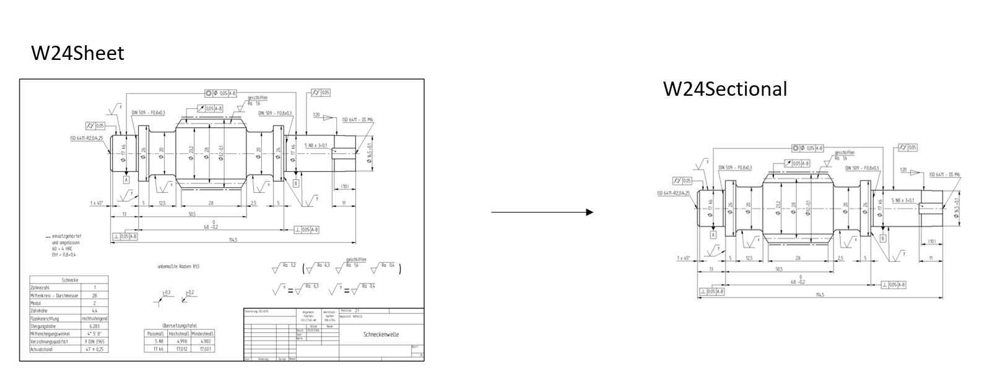

## W24Sectional

The W24Sectional is an umbrella term to describe:

1. the perspective drawings looking onto the work piece, and
2. the cuts through the work piece

### W24AskSectionalThumbnail

The W24AskSectionalThumbnail will return a thumbnail for each plane on the sheet. This also includes detail drawings.
The thumbnail will be rotated automatically.

| PAYLOAD DICT |                                                                                                       |
| ------------ | ----------------------------------------------------------------------------------------------------- |
| document_id  (`UUID4`) |Example: "44200f9b-1bb6-48bc-9370-de8a28e8dbbb" Unique `UUID` that identifies the document  |
| page_id  (`UUID4`) |Example: "89f54424-343e-4fd5-8b7d-e09ea5f310fd" Unqiue `UUID` that identifies the page      |
| sheet_id  (`UUID4`) |Example: "5bc164d4-df0d-4482-9048-3a84de010abf" Unqiue `UUID` that identifies the sheet     |
| sectional_id  (`UUID4`) |Example: "ba72f9f1-918a-43c9-8178-095ff9910024" Unqiue `UUID` that identifies the sectional |

| PAYLOAD URL |                                                                                        |
| ----------- | -------------------------------------------------------------------------------------- |
| url         | Http -- Example: https://techread.w24.io/download/93bbef40-a433-4276-bc3f-0e341c67a75c |

!!! Important

    Accessing the payload url requires a valid authentication token
