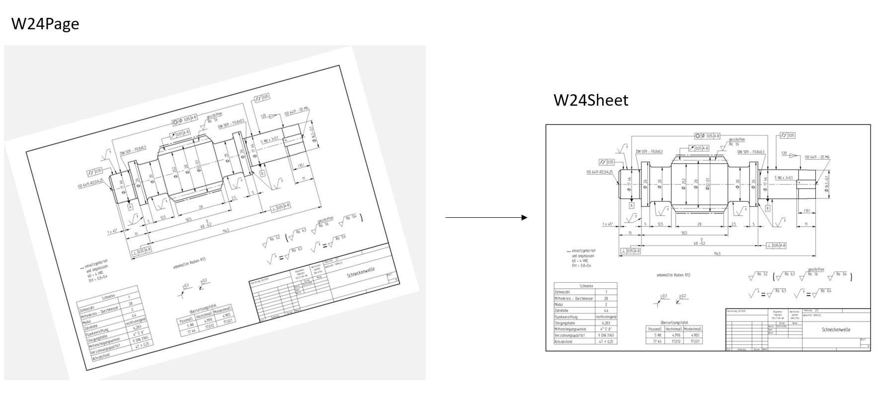

## W24Sheet

If a W24Page contains a Technical Drawing, it will be classified as W24Sheet. The Sheet corresponds to the content of the main frame on the Page. If the page does not contain such a frame, the complete Page is interpreted as Sheet.

The Sheet Thumbnail will differ from the original Document in serveral ways:

1. It is _converted to grayscale_, i.e, no matter how colorful the original drawing was, you will always receive a grayscale image in response. 
2. It is _denoised_, i.e, various kinds of noise will have been removed
3. It is _uprighted_, i.e., rotated in the way a human intelligence would

### W24AskSheetThumbnail

The W24AskSheetThumbnail will return a thumbnail for each sheet in the document.

| PAYLOAD DICT |                                                      | EXAMPLE                                      |
| ------------ | -----------------------------------------------------|---------------------------------------------- |
| document_id  (`UUID4`) |Unique `UUID` that identifies the document    |  "44200f9b-1bb6-48bc-9370-de8a28e8dbbb"       |
| page_id  (`UUID4`) |Unqiue `UUID` that identifies the page        |  "89f54424-343e-4fd5-8b7d-e09ea5f310fd"       |
| sheet_id  (`UUID4`) |Unqiue `UUID` that identifies the sheet       |  "5bc164d4-df0d-4482-9048-3a84de010abf"       |

| PAYLOAD URL |                                                       | EXAMPLE                                      |
| ----------- | ------------------------------------------------------|---------------------------------------------- |
| url (`HttpUrl`)   | Url of the payload (requires token authentication) | https://techread.w24.io/download/1a0230ea-4a96-4522-ae8e-a25aed463a3e |

