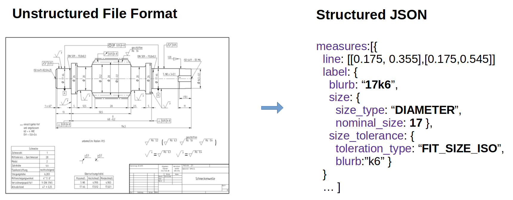

# Werk24 Documentation
Welcome to the Werk24 documentation! The following pages give you an overview on how to use our Technical Drawing Reading Services.

Our Cloud service allows you to extract structured JSON data from Technical Drawings in unstructured File Formats
like PDF, PNG, JPEG, TIFF and others.




## Clients
To make your life as easy as possible, we offer a Command Line Interfaces, as well as clients for python and nodejs. 

<table style="padding-top:15px; width:100%">
        <tr>
                <td style="text-align:center; min-width:200px">
                        <a href="/cli/basic/"></a>
                </td>
                <td style="text-align:center; min-width:200px">
                        <a href="https://pypi.org/project/werk24/"></a>
                </td>
                <td style="text-align:center; min-width:200px">
                        <a href="https://www.npmjs.com/package/werk24"></a>
                </td>
        </tr>
</table>
If you need to use our API in a different language, please reach out to us at [info@werk24.biz](mailto:info@werk24.biz).


## Installation

For your convenience, we are distributing the clients through [PyPi](https://pypi.org/project/werk24/) and [npmjs](https://www.npmjs.com/package/werk24).

=== "Python"
    ```bash
    pip install werk24
    ```

=== "NodeJS"
    ```bash
    npm install werk24
    ```


## Send your first request
To get all measures of (all variants) indicated on your drawing, you would pass an [W24AskVariantMeasures](./asks/variant_measures.md) instance along
with the drawing bytes.

=== "Python"
    ```python
    import asyncio
    from werk24 import Hook, W24TechreadClient, W24AskVariantMeasures

    async def print_measures_of_drawing(drawing_bytes):

        hooks = [Hook(ask=W24AskVariantMeasures(), function=print)]

        async with W24TechreadClient.make_from_env() as session:
            await session.read_drawing_with_hooks(document_bytes,hooks)

    asyncio.run_until_complete(print_measures_of_drawing(...))
    ```


=== "NodeJS"
    ```javascript

    async def printMeasuresOfDrawing(drawingBytes) {

        const askLib = await werk24.loadAsks();
        const hooks = [new werk24.Hook(new askLib.W24AskVariantMeasures(), console.log)];

        let client = werk24.W24TechreadClient.makeFromEnv();
        try { await client.readDrawingWithHooks(drawingBytes, hooks);}
        catch (e) { console.error(e); } finally { client.close(); }
    }

    printMeasuresOfDrawing(...)
    ```

## License File
Reach out to us at [info@werk24.biz](mailto:info@werk24.biz) to obtain your license file.