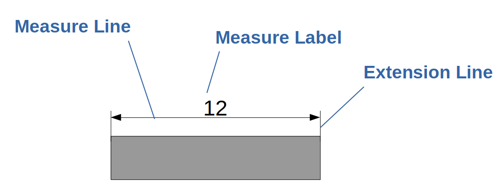
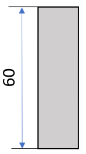
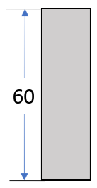
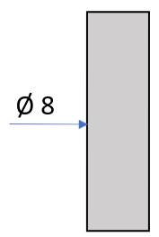
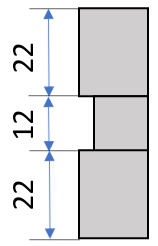
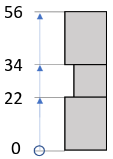

## Introduction
*DIN 406-11* defines the valid measure systems in Technical Drawings. While we are acutely aware that there are different convensions accross different geographies and industries, we use the DIN naming convensions as a solid basis and "map" the different convensions used in your Technical Drawings into the convensions that the DIN norming organisation suggests.

## Overview Measure Systems
There are probably as many ways to define Measures as there are Drafters. We do our best to interpret as many as possible and return them to you in a consistent way. Below table gives you a brief overview over the most common measure systems. 
<table>
    <tr>
        <th>
            Method 1 
            (mainly European)
        </th>
        <th>
            Method 2 
            (mainly US-American)
        </th>
        <th>
            Diameter Measures
        </th>
        <th>
            Chain Measures
        </th>
        <th>
            Ascending Measures
        </th>
    </tr>
    <tr>    
        <td>
            
        </td>
        <td>
            
        </td>
        <td>
            
        </td>
        <td>
            
        </td>
        <td>
            
        </td>
    </tr>
    <tr>
        <td>
            DIN 406-11 defines two methods for annotating simple measures. In Method 1,
            the measure labels are following the two main reading directions: (i) bottom up and (ii) from left to right. 
            This method is mainly used in European countries.
        </td>
        <td>
            Method 2 allows the drafter to draw all labels parallel to the title block. This is mainly used in the United States of America.
        </td>
        <td>
            Diameter Measures can be annotated with only one measure arrow and can be located at the inside or outside of the element. We look at the
            drawing and find the most likely interpretation for you.
        </td>
        <td>
            Chain measures can improve the readability of the drawings by using the same measure line for adjacent measures.
        </td>
        <td>
            The ascending dimensioning system is typically chosen when the number of measures increases further and space becomes a problem. The system works similar to a measuring tape by defining an origin and annotating the distance of a hole range of points from this origin.
        </td>
</table>

!!! NOTE  
    This solely provides an overview over the frequently used measure systems. We handle the complexity for you and return the same response independently of which measure system the drafter chose.

## Data Model

| PAYLOAD DICT      |                                                      | EXAMPLE                                      |
| ------------------| -----------------------------------------------------|---------------------------------------------- |
| measure_id  (`UUID4`) |Unqiue `UUID` that identifies the measure     | "15012f90-f755-48cf-b121-7542e88b9ec8"        |
| line  (`Tuple[Tuple[float,float],Tuple[float,float]]`)              | Tuple of the measure's start- and end-coordinates in the Pixel Coordinate system of the sectional. The coordinates are normalized by the width and height of the associated object (e.g., the sectional). If you want to obtain the absolute position in the original image, you need to consider the following offsets: sectional + canvas + sheet. | ((0.1,0.5),(0.2,0.5)) |
| label (`W24MeasureLabel`)             |  Details on the Measure Label    | See [W24MeasureLabel](../models/w24measure_label.md)                         |
| warnings (`List[W24MeasureWarning]`)          |  - List of Warnings that are associated with the measure. See W24MeasureWarning for details | [] |
| confidence (`float`)        |  - Werk24 calculates an internal confidence score for each measure. Depending on your use-case, you might want to consider or discard low-confidence measures. This value allows you to do so. The value ranges from 0.0 to 1.0 | 0.93 |