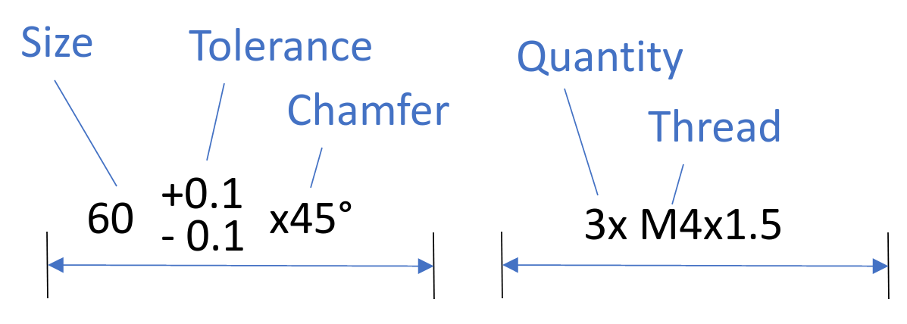

## Introduction
The MeasureLabel is a Werk24-internal data model that structures all data that a draftman might annotate on a measure. As you would expect, the [Size](../models/w24size.md) describes the size of the norm geometry. Be aware that there are multiple ways of describing the size (e.g. in millimeter, inch, width accross flats etc.). The [Tolerance](../models/w24size_tolerance.md) describes how much the work piece can differ from the nominal geometry, withouth compromising the work piece's functionality. In addition there are attributes for the [Chamfer](../models/w24chamfer.md), the quantity and the [Thread](../models/w24thread.md).

## Data Model
| PAYLOAD DICT      |                                                      | EXAMPLE                                      |
| ------------------| -----------------------------------------------------|---------------------------------------------- |
| blurb (`str`) | String representation of the item for human consumption    | 17k6                             |
| size  (`W24Size`)             | Size of the MeasureLabel. Any of `W24SizeNominal`,`W24SizeDiameter`, and `W24SizeAccrossFlats` | See [W24Size](../models/w24size.md)  for details                     |
| size_tolerance  (`W24SizeTolerance`)    | Tolerance details. Default: General tolerances.   NOTE: by default we are refering to the general tolerances of the drawing. Currently the W24SizeToleranceGeneral object is a stub. Future implementations might go one step further and quote the applicable general tolerance as refered to in the data fields.   NOTE: if the W24MeasureLabel describes a "Theoretically Exact Measure", i.e, the label is surrounded by a box, like: "[15]", the size_tolerance refers to a W24SizeToleranceTheoreticallyExact object (and is NOT None)             | See [W24SizeTolerance](../models/w24size_tolerance.md) for details                     |
| thread  (`W24Thread`)    | NOTE: the thread details describe the complete thread description and follow the respective standards. In consequence, the thread diameter of an ISO-thread will be indicated in millimeter, while the thread diameter of an UTS thread will be in inch. | See [W24Thread](../models/w24thread.md) for details                     |
| quantity  (`int`)          | Quantity for spacings.    NOTE: Currently only the indicated measure will be detected and returned. Future implementation could detect the spacings and return individual measures for the respective spacings. When we implement this feature, we will add an attribute to the ASK, which allows you to control the behavior.    |  Ø2.5 (2x) will yield quantity=2 |
| chamfer  (`W24Chamfer`)          | Optional Chamfer                     | See [W24Chamfer](../models/w24chamfer.md) for details                   |
