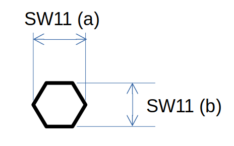

## W24Size 
`W24Size` objects describe different types of distances on the Technical Drawing. The following types are implemented
* `W24SizeNominal` - just a nominal distance between two points
* `W24SizeDiameter` - a distance measure, that actually defines a complete circle
* `W24SizeWidthAcrossFlats` - a distance measure, that potentially describes a hexagon.

### W24SizeNominal

| PAYLOAD DICT      |                                                      | Example                                       |
| ------------------| -----------------------------------------------------|---------------------------------------------- |
| blurb             | `str` -- String representation of the item for human consumption    | 2.5                            |
| size_type         | `W24SizeType` -- SizeType for deserialization.       | W24SizeType.NOMINAL                           |
| nominal_size      | `float` -- Nominal size.                             | 2.5                           |

### W24SizeDiameter

| PAYLOAD DICT      |                                                      | Example                                       |
| ------------------| -----------------------------------------------------|---------------------------------------------- |
| blurb             | `str` -- String representation of the item for human consumption    | Ø2.5                            |
| size_type         | `W24SizeType` -- SizeType for deserialization.       | W24SizeType.DIAMETER                           |
| nominal_size      | `float` -- Nominal size.                             | 2.5                           |

### W24SizeWidthAcrossFlats

Widths accross flats are typically annotated with a leading 'SW' (example SW11) and can (not always) describe a hexagon shape. Contrary to its name, the measure can positioned in two ways (see drawing below). If the measure is positioned accross edges (example (a)), the width_accross_flats will return the indicated value (here 11), while the norminal size will return the actually annotated distance on the image (here 12.7).

| PAYLOAD DICT      |                                                      | Example                                       |
| ------------------| -----------------------------------------------------|---------------------------------------------- |
| blurb             | `str` -- String representation of the item for human consumption    | SW11                            |
| size_type         | `W24SizeType` -- SizeType for deserialization.       | W24SizeType.DIAMETER                           |
| nominal_size      | `float` -- Nominal size.                             | 12.7 / 11                                      |
| width_accross_flats | `float` -- Size accross flats or Wrench sizes.     | 11                                            |

